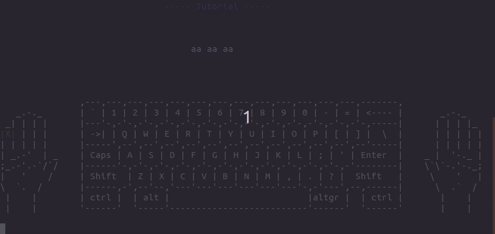

# *Touch typing tutorial*

*a TUI tutorial for typing with ten fingers*

## Presentation
[google slides](https://docs.google.com/presentation/d/1JIked5dq4Nc0FktJvRbYQM3gZxggMHE00sTvreM5FrU/edit?usp=sharing)

## How to download and use the project?

1) [install git](https://www.linode.com/docs/development/version-control/how-to-install-git-on-linux-mac-and-windows/)
2) install [python 3.6](https://www.python.org/downloads/release/python-369/)
3) `git clone https://github.com/dzhelek/Touch-typing-tutorial.git`
4) `cd Touch-typing-tutorial`
5) `python3 setup_database.py`
5) `python3 main.py`

## Used technologies

* [Python](https://www.python.org/) - *popular high-level programming language*

## Information about the authors of the project

* **Антони Стоев** - *programmer* - [astoeff](https://github.com/astoeff)
* **Йоан Джелекарски** - *programmer* - [dzhelek](https://github.com/dzhelek)

